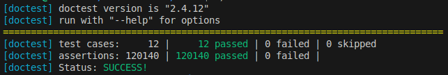

# Внешняя сортировка

## О репозитории
В данном репозитории реализованы 2 алгоритма внешней сортировки. Они различаются по числу требуемой дополнительной памяти и по числу операций с лентой. Настраивать параметры системы можно непосредственно при запуске, с помощью флагов. Также написаны тесты для обоих алгоритмов и для класса, эмулирующего внешнее устройство с помощью файлов.

## Алгоритмы
### SimpleSort
Первый алгоритм (в коде - SimpleSort) требует всего одной дополнительной ленты, однако работает за $O(\frac{N^2}{M})$ операций чтения/записи, где $N$ - длина входной ленты, а $M$ - число ячеек оперативной памяти.

Принцип работы: читаем по $M$ байт с ленты, сортируем числа в оперативной памяти. После этого, сливаем их с массивом, расположенном на запасной ленте, как в сортировке слиянием. Тогда на запасной ленте всегда отсортированный массив. Всего $\frac{N}{M}$ операций слияния, на каждую нужно $O(N)$ операций записи. Получили асимптотику выше.
### FastSort
Второй алгоритм (в коде - FastSort) требует две дополнительные ленты. Его время работы $O(N\log \frac{N}{M})$.

Принцип работы: читаем по $M$ байт и сортируем их в оперативной памяти. После этого, кладём их последовательно на две дополнительные ленты. Получили $\frac{N}{M}$ блоков, каждый из которых упорядочен. Далее мы начинаем их попарно объединять. Для этого идём двумя указателями по лентам, запоминая в оперативной памяти только два текущих значения. Всего таких проходов нужно сделать $\log \frac{N}{M}$, каждый требует $O(N) времени, что даёт нам асимптотику выше.
## Сборка и запуск
Сборка осуществляется с помощью cmake. Один из возможных примеров:

```
mkdir build
cd build
cmake ..
cmake --build .
```

После этого вы находитесь в директории с бинарником приложения.

Запуск приложения:

```
./ExternalSort <input file> <output file> <memory limit> -rw <read-write timeout> -move <move timeout> -reset <reset timeout> -type <algorithm type>
```

Первыми аргументами являются пути до соответствующих файлов. Далее идёт размер оперативной памяти в байтах. Затем идут опциональные флаги. Первые три задают задержки соответсвенно на чтение/запись байта на ленту, перевод головы ленты на соседнюю ячейку и перевод головы ленты на произвольную ячейку. Последний флаг отвечает за тип алгоритма, числу 1 соответствует SimpleSort, числу 2 - FastSort.

В процессе работы программа изменяет выходной файл, а также печатает посчитанное с учётом задержек время работы.

Пример запуска и полученных результатов:

```
./ExternalSort ../test/test_data/large_example ../test/test_data/write_example 40 -type 1
```
```
440640000
```
```
./ExternalSort ../test/test_data/large_example ../test/test_data/write_example 40 -type 2
```
```
19125400
```

На размере ленты в 40_000 байт, и размером оперативной памяти в 40 байт время работы отличается примерно в 20 раз в пользу более быстрой версии.

## Тесты

Тесты написаны с помощью библиотеки doctest. Тестировались в первую очередь алгоритмы сортировки и работа с файлами.

Чтобы их запустить, нужно собрать проект так же, как в пердыдущем пункте, после чего ввести команду:
```
./ExternalSortTest
```

